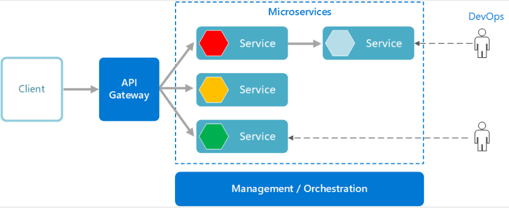

<h1>Software Architecture and Design Patterns - 2</h1>

<h2>Software Architecture</h2>

What is Software Architecture ?

 
 
fundamental structure of a software system
Software system එකක මූලික ව්‍යුහය.
 
 
Software system එකක තියෙන components, relations, system එකේ goals achieve කරගන්න ඒවා කොහොමද එකට වැඩකරන්නෙ කියල software එක ගැන High Level overview එකක් මේකෙන් බලාගන්න පුලුවන්. Software එකක් design/develop කරද්දි blueprint එක විදියට සලකයි.

Why is it important ?

 
 
Maintainability
Software එක Maintain කරන්න ලේසියි.
Software requirements හරිවිදියට fulfill වෙනවද කියල බලාගන්න පුලුවන්.
 
 
Risk management
Implement කරන්න කලින් software එක ගැන idea එකක් ගන්න පුලුවන් නිසා කලින්ම risk එක analyse කරන්න පුලුවන්.
 
 
Easy Team Collaboration
Team එකේ අනිත් අයට software එක ගැන තේරුම්ගන්න ලේසි කරයි.

Types of software architecture

1 Monolithic Architecture
 
 
A single, self-contained application where all components are tightly integrated into a single codebase.
Resource Oriented Architecture
Focuses on resources (data or services) accessible via URLs, often used in RESTful web services.
 
 
2 Client-Server Architecture
 
 
Splits the system into clients and servers, where clients request services or resources from servers.
 
 
3 Layered Architecture
 
 
Organizes the software into layers (ex: presentation, business, persistence, data) with defined interactions between them.
 
 
4 Microservices Architecture

A modular approach where a software system is divided into small, independent services that communicate through APIs.
 
 
software system එකක්, API gateway එකක් හරහා communicate කරන කුඩා, තනි services වලට බෙදා ඇති modular approach එකක්.
 
 

 
 
5 Space-based architecture (SBA)
 
 

 
 
Network එකක, multiple nodes හෝ "spaces" හරහා data සහ processing බෙදාහරින architecture එකකි.
 
 
ex :  Google File System (GFS)

Role of software architecture

Requirements Gathering: Defines project objectives and requirements.
 
High-Level Design: Creates a blueprint for the system's structure.
 
Scalability: Supports system growth and adaptability.
 
Maintainability: Simplifies updates and bug fixes.
 
Reusability: Encourages component reuse.
 
Testing Support: Facilitates thorough testing.
 
Technology Adaptability: Allows for technology updates.
 
Risk Mitigation: Identifies and addresses potential risks.
 
Development Efficiency: Streamlines development tasks.
 
Team Collaboration: Fosters effective teamwork.
 
User Satisfaction: Ensures a positive user experience.
 

Application Architecture

Application Architecture vs. Software Architecture
 
 

 

Software architecture characteristics

Software එකකින් අපේක්ෂිත qualities & properties නිර්වචනය කරන්න භාවිතා කරයි. (non-functional requirements)
 
වර්ග 2යි;
Structural
Quality attributes
 
 
Structural
 
Modularity ,
Layering,
Hierarchical decomposition,
Information hiding,
Encapsulation
 
 
Quality attributes 
 
Performance,
Scalability,
Reliability (විශ්වසනීයත්වය),
Security,
Maintainability

Quality driven attributes

Software system එකක overall quality එකට වැදගත් වෙන ගුණාංග
 
 
Performance,
Scalability,
Reliability ,
Security,
Maintainability ,
Usability,
Safety  ,

Introduction to Recurring(පුනරාවර්තන) Styles

Software development වලදි එන design & structural challenges විසදගන්න use කරන common patterns.
 
 
Recurring Styles in Software Architecture
වර්ග 4යි;
Creational,
Structural,
Behavioral,
Architectural
 
 
Creational Pattern
 
Object creation & instantiation ගැන focus කරයි. 
ex: Singleton, Factory Method, Abstract Factory, Builder, Prototype
 
 
Structural Pattern
 
Address how objects are composed to form larger structures.
ex: Facade, Adapter, Bridge, Composite, Decorator, Proxy
 
 
Behavioral Pattern
 
Objects interact & communicate ගැන focus කරයි. 
ex: Observer, Strategy, Command, State, Chain of Responsibility, Visitor
 
 
Architectural Pattern
 
මුලු system එකේම high-level organization & structure එක පාලනය කරයි.
ex: Model-View-Controller (MVC), Microservices, Layered Architecture

Design Patterns

Elegant solution to repeating problems in software design.
(Software හදද්දි නැවත නැවත එන ගැටළු වලට තියෙන විසඳුම්)
 
 
හැම Design Pattern එකක්ම, Code එකේ තියෙන problem solve කරගන්න use කරන්න පුලුවන් customizable blueprint වගේ.
Main types 3 යි;
 
 
Creational
 
Object creation ගැන තියෙන Design Patterns
Singleton Design Pattern,
Factory Design Pattern,
Prototype Design Pattern,
Builder Design Pattern,
 
 
Structural
 
Object අතර තියෙන relationships ගැන තියෙන Design Patterns
Facade Design Pattern,
Decorator Design Pattern,
Proxy Design Pattern,
Adapter Design Pattern,
Bridge Design Pattern,
Composite Design Pattern,
 
 
Behavioral
 
Object එකිනෙක අතර communicate කරන විදිය ගැන තියෙන Design Patterns
Observer Design Pattern,
Strategy Design Pattern,
Mediator Design Pattern,
State Design Pattern,
Memento Design Pattern,
Visitor Design Pattern,
Iterator Design Pattern,

1. Creational Design Patterns

Singleton Design Pattern

Class එකෙන් හැදෙන්නෙ එක instance එකයි.
ඒ instance එක access කරන්න global access point එකක් ලබාදෙයි.
 
multi-threaded / multi-process environment වල single shared resource manage කරන්න use කරයි.
(configuration manager, database connection)
 
 
key components
 
 
1 private static instance
 
2 private constructor
 
3 public static method to get instance
 
 
Single Instance (private static)
Class එකකින් එක instance එකයි හදන්න දෙන්නෙ.(The key feature of the Singleton)
 
 
static <- එක instance එකයි හදන්නෙ. 
private <- direct access වළක්වයි.
 
 
Private Constructor
	new keyword එක දාල අලුතින් object හදන එක වළක්වයි.
 
Global Access (via public static Method)
හදන single instance එකට globally access කරන්න ක්‍රමයක් ලබාදේ.
 
 
Object එක create වෙන්නෙ එක පාරයි. ආයෙ instance එක ඉල්ලුවත් දෙන්නෙ එකම instance එක.
 
 
Factory Design Pattern

 
 
Object creation logic එක hide කරයි.
 
objects create කරන්න interface එකක් සපයයි. (ShapeFactory)
 
subclasses වලට create කරන object වර්ගය වෙනස් කරන්න ඉඩ ලබාදේ. (Circle, Rectangle)
 
 
key components
 
Products (Product interface & Concrete products)
 
Factory (Factory interface & Concrete factory)
 
 
Products
 
factories වලින් හදන object. base class /interface එකකින්  products implement වෙලා තියෙන්නෙ.

 
Factory Interface
 
Interface / abstract class එකක්. Object create කරන්න method එකක් declare කරයි. (method එකේ නම "create" හෝ “factoryMethod" වගේ එකක්)
 
Concrete Factories
 
factory interface එකෙන් implement වෙලා තියෙන්නෙ.
object creation method එකේ implementation එක තියෙන්නෙ මේක ඇතුලෙ. (Object creation logic එක තියෙන්නෙ මේකෙ)
 
Concrete class
 
A "concrete class" is a class with a complete implementation that can be instantiated to create objects. It provides specific code for all methods declared in interfaces or abstract classes it extends.
 
 
2 Decorator Design Pattern
 

 
Runtime එකේදි, Existing object වලට new functionalities add කරන්න use කරයි.
Existing object එකේ code එක වෙනස් වෙන්නෙ නෑ.
 
අලුත් behaviors තියෙන special wrapper objects (decorator classes) ඇතුලට existing object දැමීම මගින් new functionalities add කරයි.
 key components
 
Component Interface 
Concrete Component(s) 
Decorator 
Concrete Decorators
 
 
Component Interface
 
Concrete components, decorators වලට තියෙන common interface එකක්. (or abstract class)
 
concrete components, decorators වලට implement වෙන්න ඕන basic operation(s) declare කරල තියෙන්නෙ මේකෙ.
 
 
interface Shape { 
    void draw(); 
 } 
 
Concrete Component(s)
 
Component interface එකෙන් implement වුණු class. 
Extend / modify කරන්න ඕන core functionality එක තියෙන්නෙ මේකෙ.
 
Decorator
abstract class එකක් / interface එකක්. 
මේකත් Component Interface එකෙන් implement වෙලා තියෙන්නෙ. 
 
Component එකක් තියාගන්න පුලුවන් reference එකක් තියෙනො. 
Component වල behaviors modify කරයි / අලුතින් add කරයි. 
 
Concrete Decorators වලට common interface එකක් සපයයි. 

